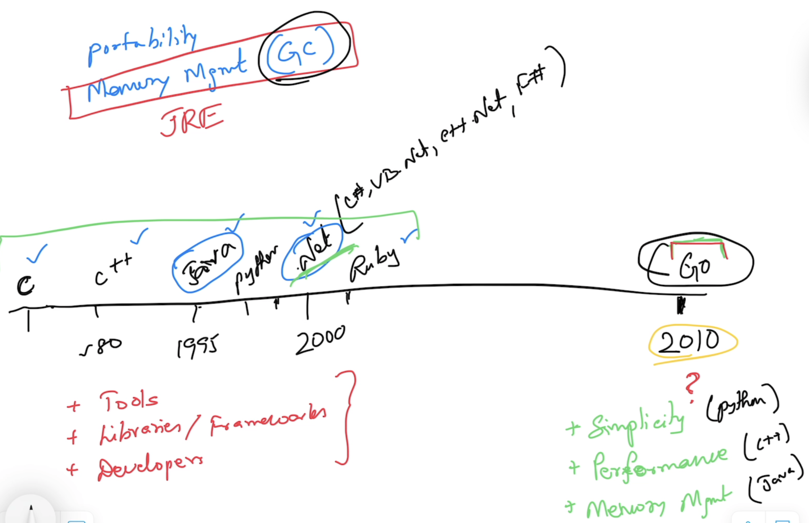

# Go Foundation

## Magesh Kuppan
- tkmagesh77@gmail.com

## Schedule
| What | When |
| ----- | ---- |
| Commence | 9:00 AM |
| Tea Break | 10:30 AM (20 mins) |
| Lunch Break | 12:30 PM (1 hour) |
| Tea Break | 3:00 PM (20 mins) |
| Wind up | 5:00 PM |

## Methodology
- NO powerpoint
- Code & Discussion
- Floor is always open for Questions

## Software Requirements
- Go Tools (https://go.dev/dl)
    ```shell
    go version
    ```
- Visual Studio Code (https://code.visualstudio.com)

## Repository
- https://github.com/tkmagesh/cisco-gofoundation-may-2025

## Why Go?
- Simplicity
    - ONLY 25 keywords
    - Only one way doing things
        - var, :=
        - if else, switch case
        - for
        - function
        - type
        - package
    - No access modifiers (NO private/public/protected keywords)
    - No reference types (everything is a value)
    - No pointer arithmatic supported by the language ( however, support offered through standard library "unsafe" package)
    - No classes (Only structs)
    - No class inheritance (Only struct composition)
    - No exceptions (Only errors & errors are just values)
    - No try..catch..finally
    - No implicit type conversion
- Performance
    - Comparable with C++
    - Close to hardware
        - Build for specific platform
        - Compiler has native support for cross compilation
- Managed Concurrency (**TBD**)
    - Builtin Scheduler to manage concurrent operations
    - "Goroutine" for concurrent operations
        - Cheap (~2KB) vs OS Thread (~4MB)
    - Concurrency support is built in the language
        - "go" keyword
        - "chan" datatype
        - "<-" operator
        - "range" construct
        - "select-case" construct
    - Standard library support
        - "sync" package
        - "sync/atomic" package



